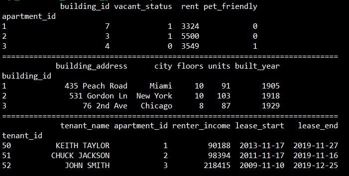

# SQL_interview_practice_generator
python project to generate puesdo data to practice for SQL interview questions
- Created: 10/23/19
- Updated: 9/12/20

## Project Overview:
While preparing for a technical interview or just brushing up on SQL, it's nice to have new, clean data. In this simple project, the python file generate_puesdo_data.py creates new puesdo-data each time it's run. The data will always have 3 tables: apartments, buildings, and tenants. Here's a preview of each table, respectively:

## About the Dataset:
- apartments relates to buildings by building_id
- apartments relates to tenants by aparment_id
- buildings and tenants have no shared columns, must be joined using apartments table

In the folder SQL_practice_questions is a list of practice SQL questions and answers for this puesdo-dataset

## Data science tools used:
- Python (language)
- pandas (python library)
- random (python library)
